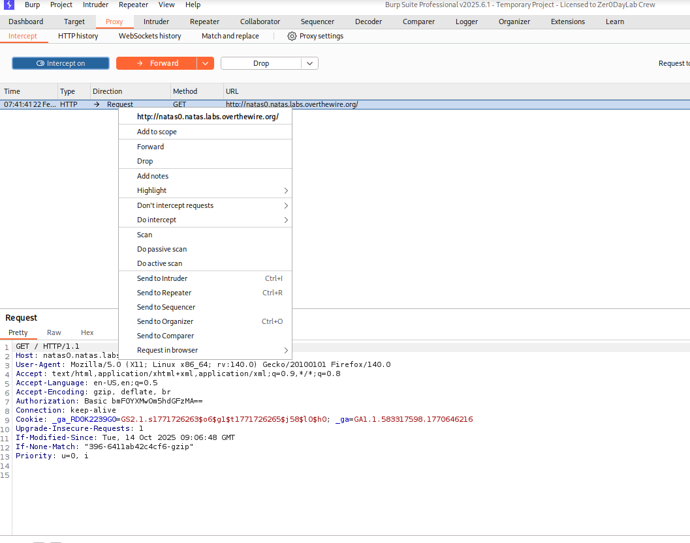

# OverTheWire: Natas Walkthrough Notes

# Level 0 

> Level Information
- **URL**: `http://natas0.natas.labs.overthewire.org`
- **Username**: `natas0`
- **Password**: `natas0`
- **Goal**: Find the password for natas1

> Solution Steps

1. Open browser and navigate to the URL above
2. Enter credentials when prompted:
   - Username: natas0
   - Password: natas0

>Step 2: Initial Observation
The page displays: *"You can find the password for the next level on this page."  

>Step 3: View Page Source

**Method A - Direct Browser (Easiest)** 
- **Right-click** anywhere on the page and select **"View Page Source"**
- OR use keyboard shortcut: `Ctrl + U` (Windows/Linux) or `Cmd + U` (Mac)

**Method B - Using Burp Suite** 
1. Configure Burp Suite as a proxy 
2. Ensure **"Intercept is on"** 
3. *Right-click* anywhere in the     intercepted request
   - Select *"Send to Repeater"* from the context menu
4. Click on **Repeater** tab (next to Proxy tab)
   - You'll see the captured request waiting there  

5. In Repeater, click the **"Send"** button
   - The response appears in the right panel   

# Level 0 - 1

> Level Information
- **URL**: `http://natas1.natas.labs.overthewire.org`
- **Username**: `natas1`
- **Password**: 0nzCigAq7t2iALyvU9xcHlYN4MlkIwlq

> Solution Steps

Method  - Using Burp Suite (Your Workflow)

Step 1: Capture Request in Proxy**
![Burp Proxy - Intercepting the request]
*Configure Burp with intercept ON and capture the login request*

**Step 2: Send to Repeater**
![Right-click menu - Send to Repeater]
*Right-click on the intercepted request and select "Send to Repeater"*

**Step 3: Request in Repeater**
![Repeater tab - Request ready]
*Request successfully transferred to Repeater tab*

**Step 4: Send and View Response**
![Repeater response - Password found]
*Click "Send" and find the password in the HTML comment*

# Level 1 - 2

> Level Information
- **URL**: `http://natas2.natas.labs.overthewire.org`
Username: natas2
Password: TguMNxKo1DSa1tujBLuZJnDUlCcUAPlI